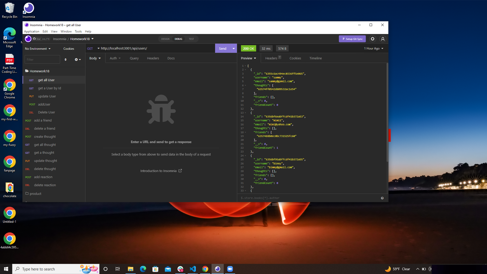
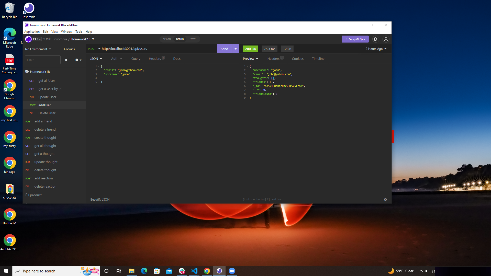

# NoSQL: Social Network API

     [video link](https://drive.google.com/file/d/19G_HA_GX6Zqvn05OLhIp1-sf0P0SLJdr/view)

    
    
    
    

## Description

I build an API for a social network web application where users can share their thoughts, react to friends’ thoughts,
and create a friend list. MongoDB is a popular choice for many social networks due to its speed with large amounts of
data and flexibility with unstructured data.I used Express.js for routing, a MongoDB database, and the Mongoose ODM.
In addition to using the Express.js.

The user can create own data using Insomnia with this API. link to the video is added to this README file.

## Uses

A social media startup wants an API for social network that uses a NoSQL database
that the website can handle large amounts of unstructured data

a social network API when a user enter the command to invoke the application,then the server is started and the Mongoose
models are synced to the MongoDB database.when the user open API GET routes in Insomnia for users and thoughts.then the
data for each of these routes is displayed in a formatted JSON
when the user test API POST, PUT, and DELETE routes in Insomnia.then the user able to successfully create, update, and
delete users and thoughts in the database.when the user test API POST and DELETE routes in Insomnia.then the user able
to successfully create and delete reactions to thoughts and add and remove friends to a user’s friend list.
